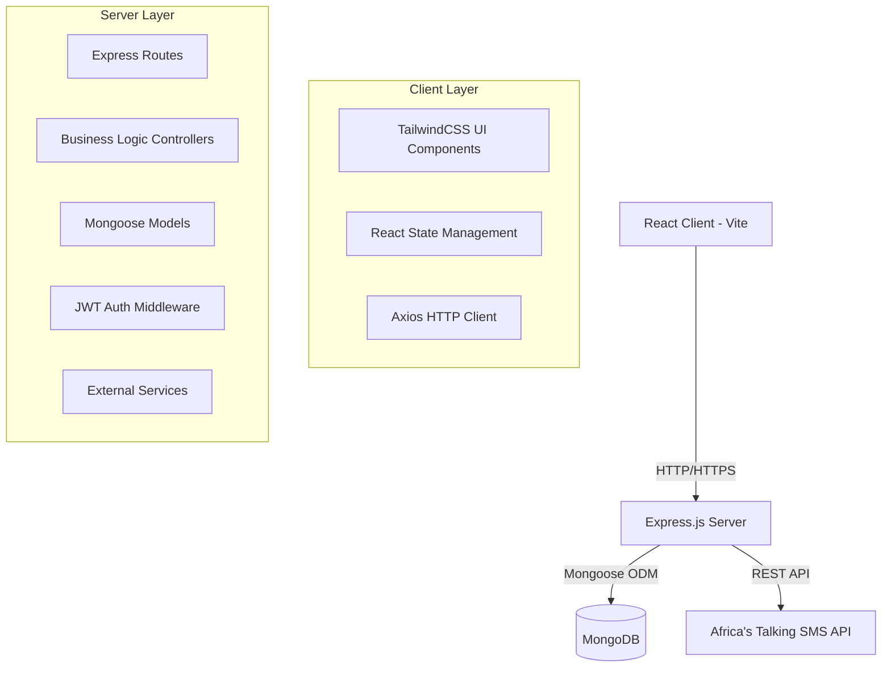

# Design Document

## Overview

The Siloam Dental & Eye Clinic Health Management System is a full-stack MERN application with a clear separation between client and server components. The system follows modern web development practices with JWT authentication, RESTful API design, and responsive UI components. The architecture supports scalability and maintainability through proper separation of concerns and modular design patterns.

## Architecture

### High-Level Architecture



### Technology Stack

- **Frontend**: React 18 with Vite, TailwindCSS, Axios
- **UI Components**: Custom design system with reusable components
- **Charts**: Recharts for dashboard analytics
- **Icons**: Lucide React for consistent iconography
- **Backend**: Node.js with Express.js, JWT authentication
- **Database**: MongoDB with Mongoose ODM
- **Package Manager**: pnpm
- **External Services**: Africa's Talking SMS API, PDFKit for invoice generation

### Responsive Design Architecture

#### Breakpoint System
```css
Mobile: 320px - 767px (sm)
Tablet: 768px - 1023px (md)
Desktop: 1024px - 1439px (lg)
Large Desktop: 1440px+ (xl)
```

#### Layout Behavior
- **Mobile (< 768px)**: Collapsed sidebar, stacked cards, simplified navigation
- **Tablet (768px - 1023px)**: Collapsible sidebar, 2-column cards, touch-optimized
- **Desktop (1024px+)**: Full sidebar, multi-column layouts, hover interactions

#### Component Responsiveness
- **Dashboard**: 1 column (mobile) → 2 columns (tablet) → 4 columns (desktop)
- **Doctor Cards**: 1 column (mobile) → 2 columns (tablet) → 3 columns (desktop)
- **Forms**: Single column (mobile) → Two column (desktop)
- **Tables**: Horizontal scroll (mobile) → Full table (desktop)

## Components and Interfaces

## Components and Interfaces

### Frontend Components

#### Design System Components
- **Card**: Reusable card component with variants (default, medical, stat)
- **Button**: Modern button system with variants (primary, secondary, success, warning, danger) and sizes
- **Input**: Consistent form input component with validation states and icons
- **Badge**: Status badge component with color-coded variants for appointment statuses
- **Table**: Professional data table with sorting, filtering, and pagination
- **Modal**: Overlay component for forms and confirmations
- **Toast**: Notification system for success/error feedback
- **LoadingSpinner**: Loading state indicators and skeleton screens

#### Layout Components
- **Layout**: Main application layout with sidebar and header
- **Sidebar**: Collapsible navigation sidebar with responsive behavior
- **Header**: Top navigation bar with user profile and notifications
- **Navbar**: Mobile-responsive navigation component
- **Container**: Content wrapper with proper spacing and max-width

#### Page Components
- **Dashboard**: Statistics cards with charts and key metrics display
- **PatientRegistration**: Two-column form card with validation and icons
- **DoctorManagement**: Grid-based doctor cards with specialization filtering
- **AppointmentBooking**: Card-based booking interface with date/time selectors
- **BillingSystem**: Professional invoice generation with PDF download

#### Shared Components
- **AuthGuard**: Route protection with loading states
- **ErrorBoundary**: Error handling with user-friendly fallbacks
- **SearchFilter**: Reusable search and filter component
- **Pagination**: Table pagination with page size options

### UI Design System

#### Color Palette
```css
Primary: #0ea5e9 (Medical Blue)
Medical: #14b8a6 (Teal)
Success: #22c55e (Green)
Warning: #f59e0b (Amber)
Danger: #ef4444 (Red)
Gray Scale: #f8fafc to #0f172a
```

#### Typography Scale
```css
Headings: Inter font family
H1: 2.25rem (36px) - Page titles
H2: 1.875rem (30px) - Section headers
H3: 1.5rem (24px) - Card titles
H4: 1.25rem (20px) - Subsections
Body: 0.875rem (14px) - Regular text
Small: 0.75rem (12px) - Captions
```

#### Spacing System
```css
xs: 0.25rem (4px)
sm: 0.5rem (8px)
md: 1rem (16px)
lg: 1.5rem (24px)
xl: 2rem (32px)
2xl: 3rem (48px)
```

#### Component Specifications

##### Dashboard Cards
- **Stat Cards**: Gradient backgrounds, icon integration, hover effects
- **Chart Cards**: Clean chart containers with proper legends and tooltips
- **Metric Display**: Large numbers with descriptive labels and trend indicators

##### Form Design
- **Input Fields**: Rounded corners, focus states, validation icons
- **Labels**: Clear hierarchy with required field indicators
- **Validation**: Real-time feedback with color-coded messages
- **Submit Buttons**: Loading states with spinner animations

##### Table Design
- **Headers**: Sticky headers with sort indicators
- **Rows**: Alternating backgrounds with hover states
- **Actions**: Icon buttons with tooltips
- **Status Badges**: Color-coded with rounded corners

##### Navigation Design
- **Sidebar**: Collapsible with smooth animations
- **Menu Items**: Active states with accent colors
- **Mobile Menu**: Overlay with backdrop blur
- **Breadcrumbs**: Clear navigation hierarchy

### Backend API Structure

#### Authentication Endpoints
```
POST /api/auth/login
POST /api/auth/register
GET /api/auth/profile
```

#### Patient Management
```
POST /api/patients
GET /api/patients
GET /api/patients/:id
PUT /api/patients/:id
```

#### Doctor Management
```
POST /api/doctors
GET /api/doctors
GET /api/doctors/:id
PUT /api/doctors/:id
```

#### Appointment System
```
POST /api/appointments
GET /api/appointments
GET /api/appointments/:id
PUT /api/appointments/:id/status
```

#### Billing System
```
POST /api/billing
GET /api/billing
GET /api/billing/:id
```

#### Dashboard Analytics
```
GET /api/dashboard/stats
```

## Data Models

### User Model
```javascript
{
  _id: ObjectId,
  username: String (required, unique),
  email: String (required, unique),
  password: String (required, hashed),
  role: String (enum: ['admin', 'staff']),
  createdAt: Date,
  updatedAt: Date
}
```

### Patient Model
```javascript
{
  _id: ObjectId,
  fullName: String (required),
  phone: String (required),
  email: String (required, unique),
  dateOfBirth: Date (required),
  gender: String (enum: ['Male', 'Female', 'Other']),
  address: String (required),
  nationalId: String (required, unique),
  medicalNotes: String,
  createdAt: Date,
  updatedAt: Date
}
```

### Doctor Model
```javascript
{
  _id: ObjectId,
  name: String (required),
  specialization: String (enum: ['Dental', 'Eye']),
  phone: String (required),
  email: String (required, unique),
  availableDays: [String] (enum: ['Monday', 'Tuesday', 'Wednesday', 'Thursday', 'Friday', 'Saturday', 'Sunday']),
  createdAt: Date,
  updatedAt: Date
}
```

### Appointment Model
```javascript
{
  _id: ObjectId,
  patientId: ObjectId (ref: 'Patient'),
  doctorId: ObjectId (ref: 'Doctor'),
  date: Date (required),
  time: String (required),
  reason: String (required),
  status: String (enum: ['pending', 'approved', 'rejected'], default: 'pending'),
  createdAt: Date,
  updatedAt: Date
}
```

### Billing Model
```javascript
{
  _id: ObjectId,
  patientId: ObjectId (ref: 'Patient'),
  doctorId: ObjectId (ref: 'Doctor'),
  appointmentId: ObjectId (ref: 'Appointment'),
  invoiceNumber: String (unique, auto-generated),
  services: [{
    name: String,
    cost: Number
  }],
  totalAmount: Number (required),
  pdfPath: String,
  createdAt: Date,
  updatedAt: Date
}
```

## Error Handling

### Frontend Error Handling
- **API Error Interceptor**: Axios interceptor for handling HTTP errors
- **Form Validation**: Client-side validation with error messages
- **Error Boundaries**: React error boundaries for component-level error handling
- **Toast Notifications**: User-friendly error and success messages

### Backend Error Handling
- **Global Error Middleware**: Centralized error handling middleware
- **Validation Errors**: Mongoose validation error handling
- **Authentication Errors**: JWT token validation and expiration handling
- **Database Errors**: MongoDB connection and operation error handling

### Error Response Format
```javascript
{
  success: false,
  message: "Error description",
  error: "Detailed error information (development only)",
  statusCode: 400
}
```

## Testing Strategy

### Frontend Testing
- **Unit Tests**: Component testing with React Testing Library
- **Integration Tests**: API integration testing with mock services
- **E2E Tests**: Critical user flows with Cypress (optional)

### Backend Testing
- **Unit Tests**: Controller and service function testing with Jest
- **Integration Tests**: API endpoint testing with supertest
- **Database Tests**: Model validation and database operation testing

### Test Coverage Goals
- **Controllers**: 80% code coverage minimum
- **Models**: 90% validation coverage
- **Critical Paths**: 100% coverage for authentication and billing

## Security Considerations

### Authentication & Authorization
- **JWT Tokens**: Secure token-based authentication
- **Password Hashing**: bcrypt for password security
- **Role-Based Access**: Different access levels for admin and staff
- **Token Expiration**: Configurable token expiration times

### Data Protection
- **Input Validation**: Comprehensive input sanitization
- **SQL Injection Prevention**: Mongoose ODM protection
- **CORS Configuration**: Proper cross-origin resource sharing setup
- **Environment Variables**: Sensitive data in environment configuration

### API Security
- **Rate Limiting**: Request rate limiting middleware
- **Helmet.js**: Security headers middleware
- **HTTPS Enforcement**: SSL/TLS encryption in production
- **Input Sanitization**: XSS and injection attack prevention

## Performance Optimization

### Frontend Optimization
- **Code Splitting**: React lazy loading for route-based splitting
- **Image Optimization**: Compressed images and lazy loading
- **Caching Strategy**: Browser caching for static assets
- **Bundle Analysis**: Webpack bundle analyzer for optimization

### Backend Optimization
- **Database Indexing**: Proper MongoDB indexing strategy
- **Query Optimization**: Efficient database queries with population
- **Caching Layer**: Redis caching for frequently accessed data (future enhancement)
- **Compression**: Gzip compression for API responses

## Deployment Architecture

### Development Environment
- **Client**: Vite dev server on port 5173
- **Server**: Express server on port 5000
- **Database**: Local MongoDB instance
- **Package Management**: pnpm workspaces for monorepo structure

### Production Considerations
- **Build Process**: Optimized production builds
- **Environment Configuration**: Separate configs for dev/staging/production
- **Process Management**: PM2 for Node.js process management
- **Monitoring**: Application performance monitoring setup
- **Backup Strategy**: Automated database backup procedures